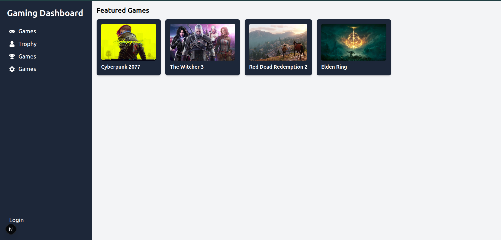

*Screenshot: Main dashboard view of the Intercepting Routes Game Project*

# Intercepting Routes Game Project

A modern web application built with Next.js 15 and React 19, featuring a gaming dashboard with authentication and a showcase of popular games. This project demonstrates advanced routing, component-based architecture, and clean UI design.

## Features

- **Next.js 15 App Router**: Utilizes the latest Next.js routing features, including intercepting routes.
- **Authentication**: Simple login modal and page for user authentication.
- **Gaming Dashboard**: Sidebar navigation and featured games display.
- **Reusable Components**: Modular React components for scalability.
- **TypeScript**: Type-safe codebase for reliability and maintainability.
- **Tailwind CSS**: Utility-first CSS for rapid UI development.

## Directory Structure

```
intercepting-routes-game-project/
├── public/                # Static assets (images, icons, etc.)
├── src/
│   ├── app/               # Next.js app directory (routing, pages, layouts)
│   │   ├── games/         # Games page and intercepting login route
│   │   ├── login/         # Standalone login page
│   │   ├── globals.css    # Global styles
│   │   ├── layout.tsx     # Root layout
│   │   └── page.tsx       # Home page
│   ├── components/        # Reusable UI components (Sidebar, GameCard)
│   └── db/                # Static data (games list)
├── package.json           # Project metadata and dependencies
├── tsconfig.json          # TypeScript configuration
├── next.config.ts         # Next.js configuration
└── README.md              # Project documentation
```

## Main Components & Pages

- **Home Page (`src/app/page.tsx`)**: Welcome page with Next.js and Vercel links.
- **Games Page (`src/app/games/page.tsx`)**: Displays a sidebar and a grid of featured games.
- **Login Modal (`src/app/games/(..)login/page.tsx`)**: Intercepting route for login, shown as a modal over the games page.
- **Login Page (`src/app/login/page.tsx`)**: Standalone login form.
- **Sidebar (`src/components/Sidebar.tsx`)**: Navigation for the dashboard.
- **GameCard (`src/components/GameCard.tsx`)**: Card component for displaying individual games.
- **Data (`src/db/data.ts`)**: Static array of game objects (id, name, image).

## Data Structure

Example game object from `src/db/data.ts`:
```ts
{
  id: 1,
  name: "Cyberpunk 2077",
  img: "https://.../cyberpunk.jpeg"
}
```

## Getting Started

### Prerequisites
- Node.js 18+
- npm (comes with Node.js)

### Installation
```bash
# Clone the repository
$ git clone <your-repo-url>
$ cd intercepting-routes-game-project

# Install dependencies
$ npm install
```

### Development
```bash
# Start the development server
$ npm run dev
```
Visit [http://localhost:3000](http://localhost:3000) to view the app.

### Build for Production
```bash
$ npm run build
$ npm start
```

## Technologies Used
- [Next.js 15](https://nextjs.org/)
- [React 19](https://react.dev/)
- [TypeScript](https://www.typescriptlang.org/)
- [Tailwind CSS](https://tailwindcss.com/)
- [ESLint](https://eslint.org/)

## Customization & Extensibility
- Add more games by editing `src/db/data.ts`.
- Extend the sidebar or add new pages/components in `src/components/` and `src/app/`.
- Customize styles in `src/app/globals.css` or via Tailwind classes.

## License
This project is for educational/demo purposes. Add your license here if needed.
