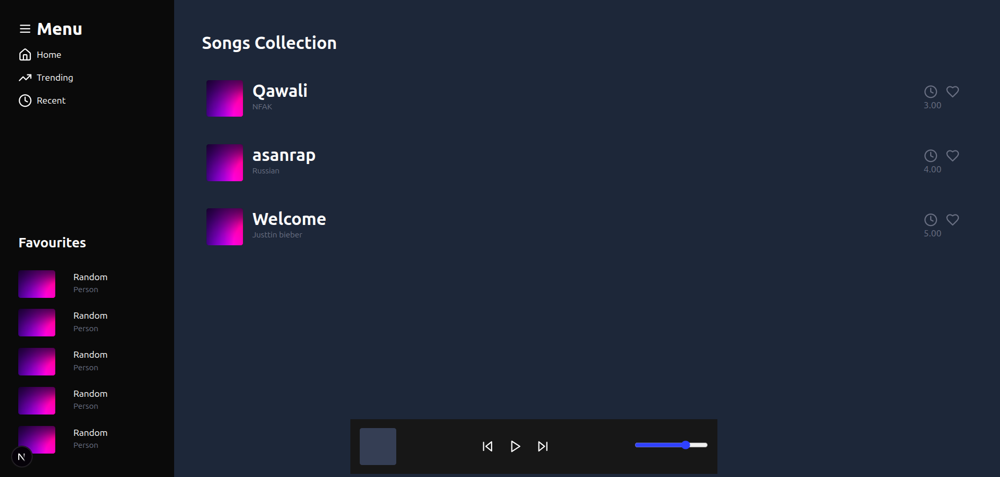

# Music Player Using Parallel Routes



---

## 🎵 Project Overview

This project is a modern music player built with **Next.js 15 App Router** and **React 19**, utilizing **parallel routes** for advanced layout composition. It features a sidebar, a dynamic songs collection, and a persistent player component, all styled with Tailwind CSS.

---

## 📁 Folder Structure

```
/app
  /musics
    layout.tsx           # Main layout with parallel slots
    default.tsx          # Default fallback for musics route
    page.tsx             # Main musics page
    /@sidebar            # Parallel route for sidebar
      page.tsx           # Sidebar content
      default.tsx        # Sidebar fallback
      loading.tsx        # Sidebar loading state
    /@songs              # Parallel route for songs
      page.tsx           # Songs list
      [id]/page.tsx      # Dynamic song details
      default.tsx        # Songs fallback
      loading.tsx        # Songs loading state
    /@player             # Parallel route for player
      page.tsx           # Player component
      default.tsx        # Player fallback
      loading.tsx        # Player loading state
/public
  bg.jpg                 # Example image used in the UI
  ...                    # Other static assets
```

---

## ⚠️ Common Problems with Components

- **Component Not Rendering:**
  - If you use parallel routes (e.g., `@sidebar`, `@player`) but do not provide a `default.tsx` in those folders, you will get a 404 error on dynamic routes or the slot will be empty.
  - If you reference images from the `public` folder, ensure the file name and extension match exactly (case-sensitive on Linux).
- **Slot Not Filled:**
  - If a slot is not filled for a given route and there is no `default.tsx`, the layout cannot be rendered and Next.js throws a 404.
- **Loading State Issues:**
  - Typos in special files like `loading.tsx` (e.g., `laoding.tsx`) can break route transitions or slot rendering.

---

## 🚀 How Parallel Routes Solve These Problems

- **Flexible Layouts:** Parallel routes allow you to define independent UI regions (slots) that can be filled or left empty (with a default) on a per-route basis.
- **Persistent UI:** Components like the player can persist across navigation, without being unmounted, by being placed in a parallel route slot.
- **Fallbacks:** By providing a `default.tsx` in each parallel route folder, you ensure that your layout always has something to render, preventing 404 errors and broken UIs.
- **Separation of Concerns:** Each UI region (sidebar, songs, player) is managed in its own folder, making the codebase modular and maintainable.

> **ℹ️ Note:**
> Without parallel routes, loading and error files for components (like `loading.tsx` and `error.tsx`) do **not** get executed for those components. Parallel routes enable per-slot loading and error handling, making your UI more resilient and user-friendly.

---

## 🛠️ Getting Started

1. **Install dependencies:**
   ```bash
   npm install
   ```
2. **Run the development server:**
   ```bash
   npm run dev
   ```
3. **Open your browser:**
   Visit [http://localhost:3000/musics](http://localhost:3000/musics)

---

## 📝 Notes
- Make sure to add `default.tsx` files in every parallel route folder (`@sidebar`, `@songs`, `@player`) to avoid 404 errors on dynamic routes.
- For static assets, always use the correct path and file extension (e.g., `/bg.jpg`).
- If you encounter issues with loading states, check for typos in filenames like `loading.tsx`.

---

